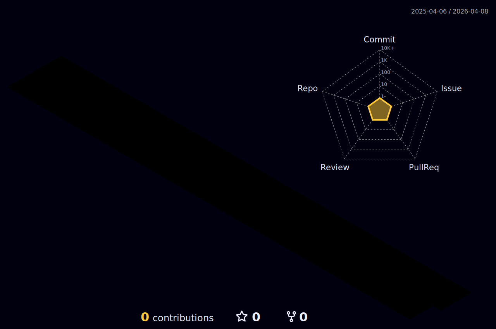

</img>  

<h2 align="center">A Passionate Future Machine Learning Engineer from Turkey</h2>

## I'm a Self-Taught, Contributor, Developer and Researcher!!

- 🔭 Self-Learning right now. I'm documenting my #365DaysOfCode journey...
- 🧙‍♂️ I'm Community Coordinator at [@Iterative](https://iterative.ai/), which is an MLOps company. 
- 🎯 I’m currently learning Julia language and MLOps
- 👯 Fun fact: I love to dance(salsa, bachata) and meet new people
- 🥅 2022 Goals: Contribute more to Open Source and Communities below;

&emsp;&emsp;&emsp;&ensp;
   
 

 

 ## ⭐ My projects

<!---* [MIT-Stanford based Self-Taught-Degree](https://github.com/mertbozkir/self-taught-degree)📌 -->
 
<!---* * [👊 Project D: Riot Games Data Science](https://github.com/mertbozkir/Riot-Games-Data-Science) -->
* [RFM Customer Segmentation❤️‍🔥Streamlit](https://github.com/mertbozkir/RFM_Customer_Segmentation_Streamlit) 
* [PresentX: GPT-3 Based Latex Code Presentation Maker](https://github.com/mertbozkir/PresentX)  🪐
* [Home-Credit-Default-Risk Analysis with GBMs](https://github.com/mertbozkir/Home-Credit-Default-Risk) 🧩
* [MIT Deep Learning Lab 1: Music Generation with RNNs](https://github.com/mertbozkir/Music_Generation_RNNs)  🎶

 

## ⚡ Recent Activity
<!--START_SECTION:activity-->
1. ❗️ Opened issue [#4](https://github.com/mertbozkir/DVC.jl/issues/4) in [mertbozkir/DVC.jl](https://github.com/mertbozkir/DVC.jl)
2. ❗️ Opened issue [#3](https://github.com/mertbozkir/DVC.jl/issues/3) in [mertbozkir/DVC.jl](https://github.com/mertbozkir/DVC.jl)
3. ❗️ Opened issue [#2](https://github.com/mertbozkir/DVC.jl/issues/2) in [mertbozkir/DVC.jl](https://github.com/mertbozkir/DVC.jl)
4. ❗️ Opened issue [#1](https://github.com/mertbozkir/DVC.jl/issues/1) in [mertbozkir/DVC.jl](https://github.com/mertbozkir/DVC.jl)
5. ❗️ Opened issue [#10](https://github.com/mertbozkir/mertbozkir.github.io/issues/10) in [mertbozkir/mertbozkir.github.io](https://github.com/mertbozkir/mertbozkir.github.io)
<!--END_SECTION:activity-->

## 📬 Connect with me:

&nbsp;
&nbsp;
&nbsp;
&nbsp;
&nbsp;
 
<!--

  
  

-->
